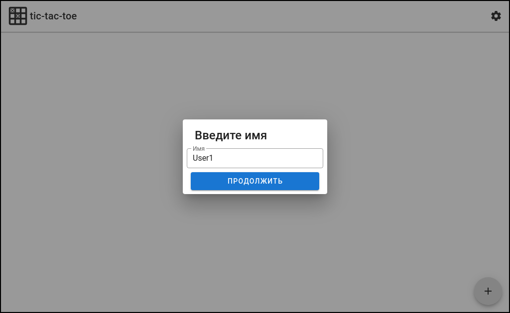
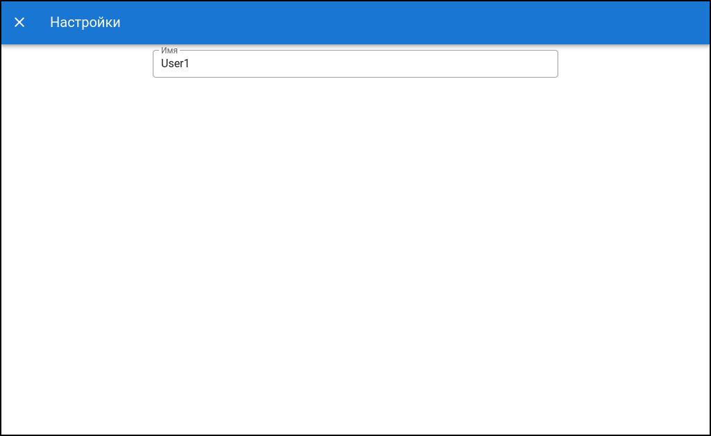
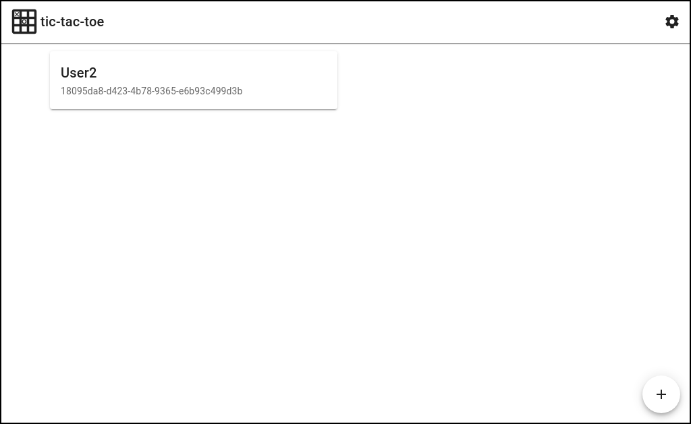
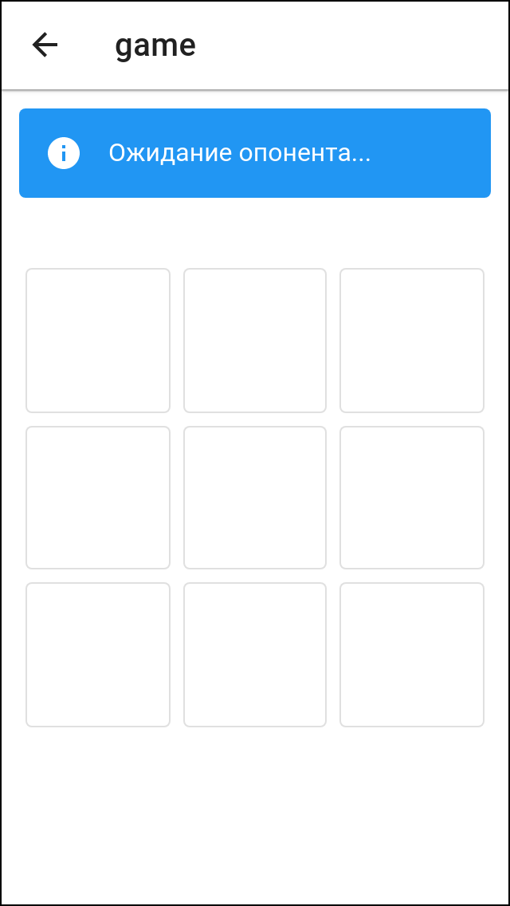
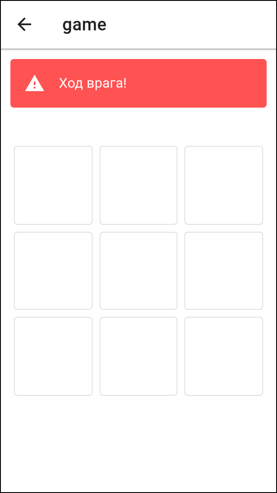
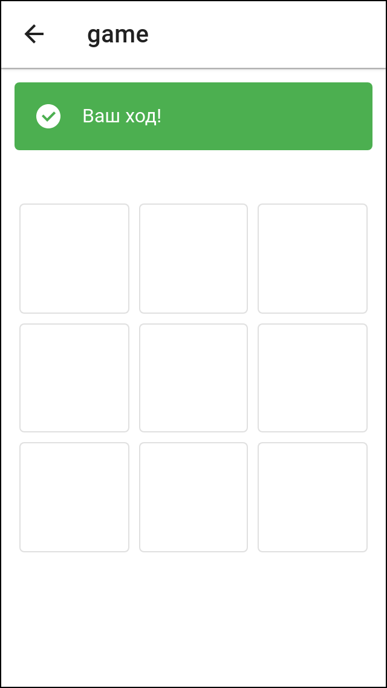
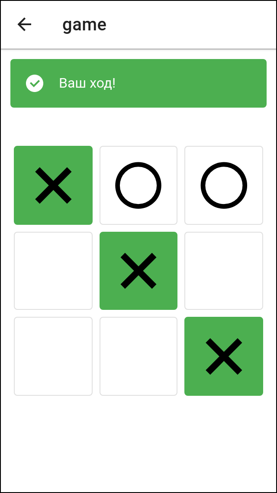
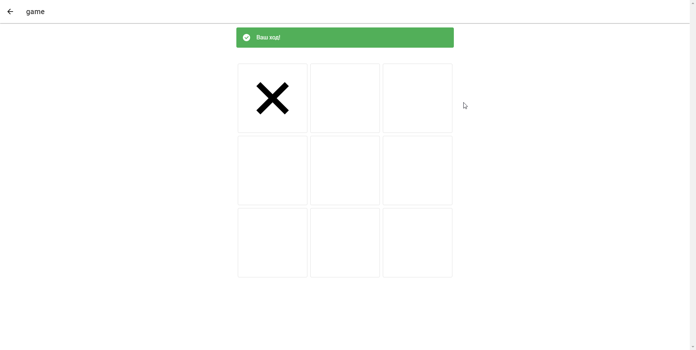

<p align="center">
    
    <h3 align="center">tic-tac-toe</h3>
    <h4 align="center">Тестовый проект для WebSockets</h4>
</p>

---

### Сборка и запуск

```sh
cd tic-tac-toe
yarn
yarn run build
yarn run start
```

## Скриншоты

<h3>Вход, настройки и выбор комнаты</h3>
<p align="center">
  
   
  
</p>

<h3>Ожидание противника, игра</h3>
<p align="center">
  
  
  
  
</p>

<h3>Демонстрация</h3>
